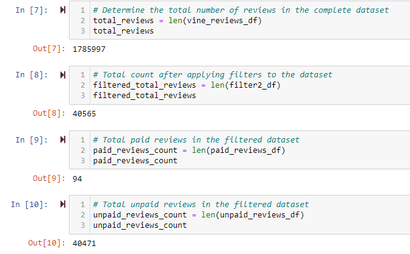
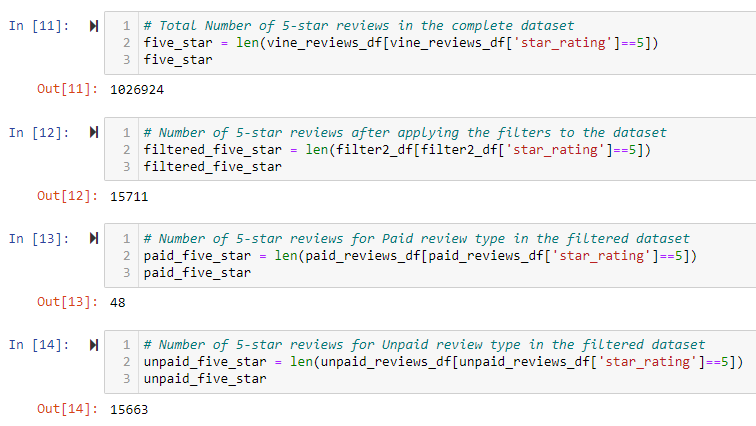
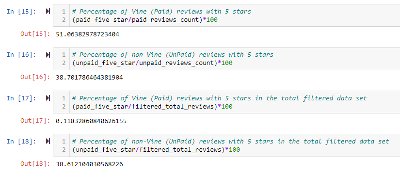

# Amazon_Vine_Analysis
Analysis on Amazon's vine review program using PySpark and AWS RDS with PostgreSQL to help SellBy company with the decision to invest in Vine program for their products. The Amazon Vine program is a service that allows manufacturers and publishers to receive reviews for their products. For this project, 

## Overview of the analysis: Explain the purpose of this analysis.
In this project, I'll be used the data set with reviews for video games. I used PySpark to perform the ETL process to extract the dataset, transform the data, connect to an AWS RDS instance, and load the transformed data into pgAdmin. Next, using Pandas I'll determine if there is any bias toward favorable reviews from Vine members in the video games reviews dataset. 

## Results:

### How many Vine (Paid) reviews and non-Vine (Unpaid) reviews were there?

There were 94 Vine reviews and 40471 non-Vine reviews.

### How many Vine reviews were 5 stars and how many non-Vine reviews were 5 stars?

There were 48 Vine reviews with 5 stars and 15663 non-Vine reviews with 5 stars.

### What percentage of Vine reviews were 5 stars? What percentage of non-Vine reviews were 5 stars?

There were 51% of Vine reviews with 5 stars in the Vine reviews dataset. And, there were 38.7% non-Vine reviews with 5 stars in the non-Vine reviews dataset.

But, when considering Vine reviews with 5 stars as a percent of dataset with the below filters, the value is nearly 0% (0.12%). Similarly, the non-Vine reviewa with 5 stars percentage is 38.6%.

    Filters applied to the dataset before startting the analyis:
        - filter 1: total_votes being greater than or equal to 20
        - filter 2: number of helpful_votes divided by total_votes is equal to or greater than 50% 

## Summary: 

To summarize, 
1. there were a **total** of 1,785,997 **reviews** in the dataset, out of which there were only 40,565 **helpful** reviews,
2. Out of the 40,565 **helpful** reviews, there were just 94 **Vine (paid)** reviews and 40,471 **non-Vine (unpaid)** reviews, thus indicating that the data is skewed,
3. Of the 94 **Vine (paid)** reviews 48 of them have **5-stars** (which is 51%) indicating **positivity bias** in the Vine (paid) program,
4. there are 15,663 reviews with **5-stars** out of the 40,471 **non-Vine (unpaid)** reviews, which is 38.7%, a more realistic number. 

### Additional Recommendation:
You can see from above that the Vine program actually results in getting more 5-star reviews. But, there were only 94 **helpful** reviews from the Vine program versus non-Vine's 40,471 **helpful** reviews. Also, the non-Vine reviews have 38.7% 5-star reviews versus Vine's 51% indicating people not in Vine program are also providing 5-star rating. Futher analysis using NPL Sentiment Analysis on Vine program with 5-star dataset and non-Vine program with 5-star dataset and comparing the results might provide more insights which might help with making the decision to invest in Vine Program. 

## Resources:
Data source: 
- [Video Games Reviews](https://s3.amazonaws.com/amazon-reviews-pds/tsv/amazon_reviews_us_Video_Games_v1_00.tsv.gz)
Software:
- Python
- Jupyter Notebook
- Pandas
- PostgresSQL
- AWS-RDS
- Google Colab 
- PySpark
